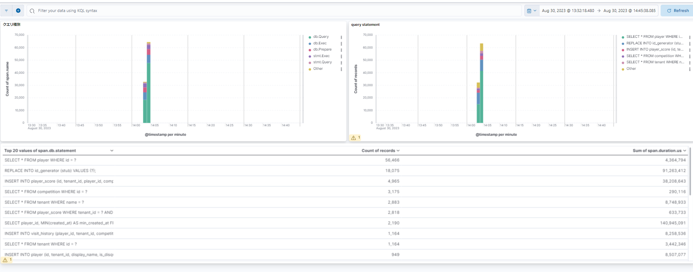
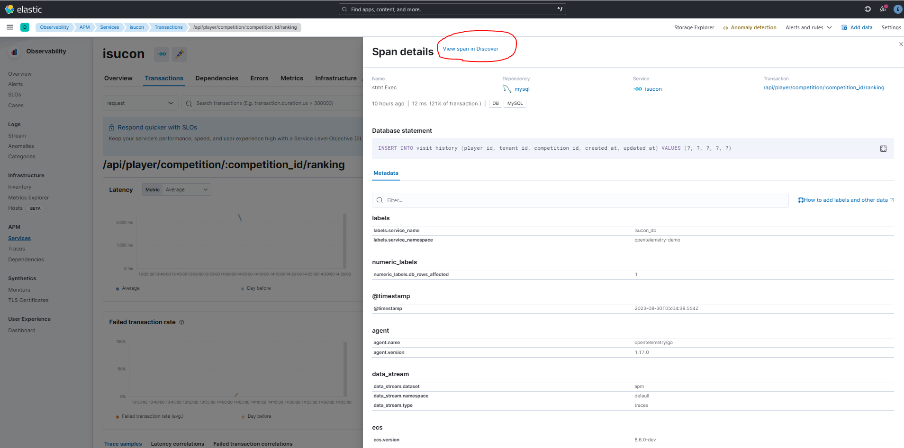
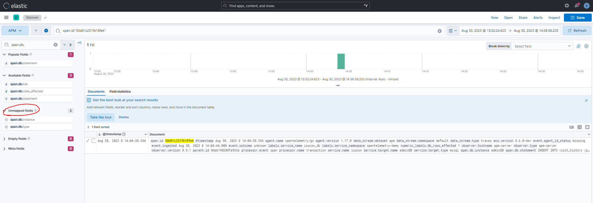
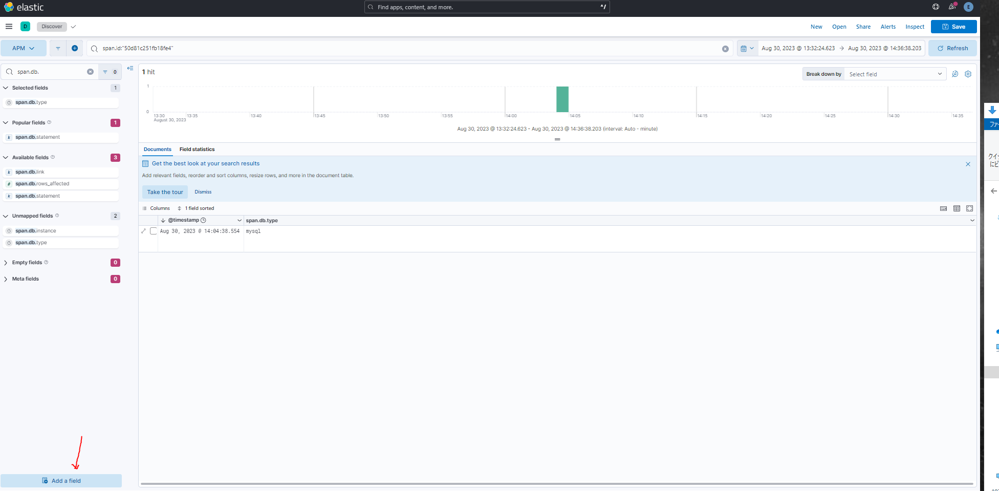

# otel-apm setting for isucon

ISUCONで、Elastic Stack + OpenTelemetry によるトレーシング・APMを行うためのメモ


## メモ

docker-elkなどを使って、Elastic SearchとKibanaを構築。LogStashはどちらでもOKのはず。
- https://github.com/deviantony/docker-elk


動かせたら、適当にKibanaにログインしてみて動作を確認。


Elastic APM-Serverを次は構築する。
Docker-ELKのレポジトリものは使わないように注意。(Fleet管理のElastic AgentによるAPM Serverが動くような構成になっているため)

公式マニュアルのこれを参考にして、Docker Composeで起動できるようにする。
https://www.elastic.co/guide/en/apm/guide/current/running-on-docker.html


ポートのマッピングなどがややこしくなるので、network mode を hostにしている。
これを起動すると デフォルト8200で listenしてくれる。ElasticSearch側にはBasic認証でいってくれるので適当にパスワードつかう。
他にもAPIキー使うことも可能。


APM ServerのGitHubはこれ
https://github.com/elastic/apm-server


APM-Serverが動いたら、今度はOtel-Collectorを起動する。
Otel-Collector -> APM Server -> Elastic Search で送る。
Otel-CollectorからElasticSearchに送るとかもできるらしいが、APM Server立てたほうが安定らしい。

これも

この辺を参考にしてOpenTelemetryの receiver, exporter 周りを設定する。
- https://qiita.com/shosuz/items/1eee784c5dd8f009e204
- https://qiita.com/mkyz08/items/4d331cd968a0ac4693d3
- https://github.com/open-telemetry/opentelemetry-demo/blob/main/src/otelcollector/otelcol-config.yml
- https://github.com/open-telemetry/opentelemetry-collector/blob/main/receiver/otlpreceiver/README.md

これを設定できると、OpenTelemetry Collector周りの構成がイメージがつかみやすくなるはず。

Elastic SearchのAPM Server自体への認証はかけてないので適当にExporterで APM Serverに投げつける。

Otel-ReceiverはHTTPで受けるようにする。
grpcでも受けられるらしいが、動かそうとしたらエラーがでていたのでやめた。（なにかライブラリが足りてないみたいなログ）


構築できたら、この辺のデモアプリからOtel-Colにむけてメトリクスを投げつけたものがElasticSearchまで来ているか確認するとよい。
https://github.com/open-telemetry/opentelemetry-demo


もしくは、このサンプルのjsonをOtel側になげて、APM-Serverが反応してるかでもいいかも。（自分はこれで投げたものはElasticSearch側では確認できなかった）
https://www.honeycomb.io/blog/test-span-opentelemetry-collector


## アプリ側の設定

環境変数で、OTEL用各種設定を入れる。

この辺の設定内容が最終的にElasticSearchのDocument内容に入る。
```yaml
OTEL_EXPORTER_OTLP_ENDPOINT: http://10.0.0.11:4318
OTEL_EXPORTER_OTLP_METRICS_TEMPORALITY_PREFERENCE: cumulative
OTEL_RESOURCE_ATTRIBUTES: "service.namespace=opentelemetry-demo"
OTEL_TRACES_EXPORTER: "otlp"
OTEL_SERVICE_NAME: "isucon"
```

ソースコード側は、autoexportを利用していい感じにexportを作って、traceProviderにわたす。そのtraceProviderをotelに渡してあげる必要がある。
これをやらないと、otelのtraceProviderがnilになって何もExportしてくれなくなる。

```go
// "go.opentelemetry.io/contrib/exporters/autoexport" あたりを利用。
	exporter, err := autoexport.NewSpanExporter(context.Background())
	tp := sdktrace.NewTracerProvider(
		sdktrace.WithBatcher(exporter),
	)
	otel.SetTracerProvider(tp)

	e.Use(otelecho.Middleware("my-server"))
```


Elastic APM はsqlxに対応していなかったが、otelはsqlxに対応している。こんな感じで指定すればいい
```go
return otelsqlx.Open("mysql", dsn,
		otelsql.WithAttributes(semconv.DBSystemMySQL),
		otelsql.WithAttributes(attribute.KeyValue{Key: "service.name", Value: attribute.StringValue("isucon_db")}),
		otelsql.WithDBName("adminDB"),
	)
```

ISUCON12のsqliteもこれでOK。

```go
	db, err := otelsqlx.Open(sqliteDriverName, fmt.Sprintf("file:%s?mode=rw", p), 
		otelsql.WithAttributes(semconv.DBSystemSqlite),
		otelsql.WithAttributes(attribute.KeyValue{Key: "service.name", Value: attribute.StringValue("isucon_db_sqlite")}),
		otelsql.WithDBName(strconv.FormatInt(id, 10)),
	)
```

そのままだと、ElasticSearchのAPMの画面ではクエリの発行数などの解析はし辛い。
Documentには以下のようなかたちで入ってくるので、自分でダッシュボードを作ってspan.db.statementで括れば見やすくなる。

```
span.db.statement   SELECT * FROM tenant WHERE name = ?
```




Kibanaの Saved Objects からDashboardはエクスポートできる。（インポートするときもここから）

export.ndjsonをいい感じに取り込めばいけるはず。


## その他メモ

Elastic AgentをFleetからEnrollした場合は、Elastic Agent内蔵のAPMサーバー機能が動くとからしい。
ほんと？







otelから取り込んだ一部の値はUnmapped fieldsになってるはずなので、ここからfieldとしてあつかえるようにする。

